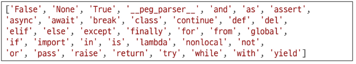
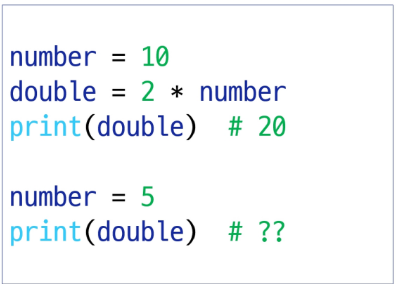
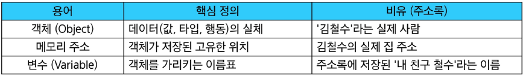
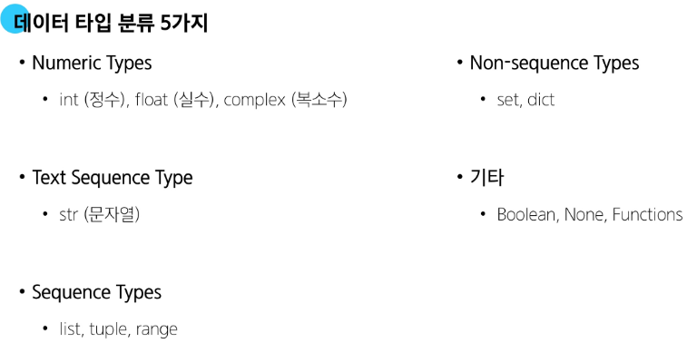
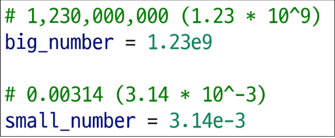
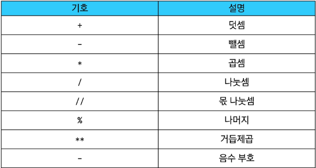
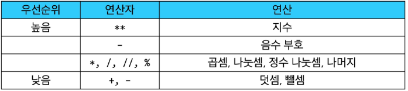
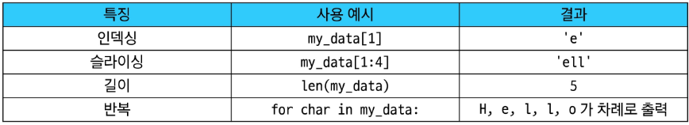
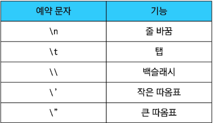
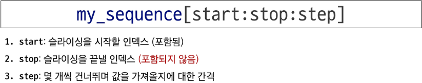

# 25.07.16


1. 기초 문법
   
   - touch : 파일 생성
   - mkdir : 새 디렉토리 생성
   - ls : 리스트
   - cd : change directory
   - start : 열기
   - rm : remove
   - pwd : 현재 위치 확인


2. 경로
   
   - / : 루트 디렉토리
   - ~ : 홈 디렉토리


3. 마크다운
   
   - code block : ` 3개 ```print(하윙)```
   - 링크, 이미지 : [] 대괄호 활용 [google](링크), 
   - 글꼴 : * 두개 **굵게**, * 하나 *기울이기* ~두개 ~~취소선~~
   - 수평선 : - 3개 아래 처럼
   - 마크다운 가이드 : https://www.markdownguide.org/basic-syntax/


---


# 25.07.17


1. git 활용
   
   - git init : 시작
   - git add 파일이름 or . : staging area 올리기
   - git status : staging area 확인
   - git commit -m '????' : Repository 저장
   - git commit --amend : commit 메시지 수정 (vim들어가서)
   

2. Remote Repository
   
   - 원격 저장소 GitHub
   - 원격 저장소 추가 : git remote add *origin* (GitHub링크)
   - 저장소에 자료 넣기 : git push *origin* master
   - git clone *origin* master : 복사해서 가져오기
   - git pull *origin* master : 변경사항 가져오기
   - .gitignore : 올리기 싫은거 git init 전에 만들기
   - git remote -v : 저장소 목록 보기
   - git remote rm *origin* : *origin*(저장소 이름) 삭제


3. Git Revert
   
   - git revert commit_id : 없던일로하기, 기록 남음
   - git revert commit_id1 commit_id2 commit_id3 : 여러개 없애기
   - git revert commit_id1..commit_id3 : 범위 지정해서 없애기
   - git revert --no-edit commit_id : vim 안열고 바로
   - git revert --no-commit commit_id : 바로 commit ㄴ, staging area에만 올림


4. Git Reset
   
   - git reset [옵션] commit_id : 되돌리기
   - [옵션] --hard : 기록 없이 삭제
   - [옵션] --mixed : [옵션]칸 비워도 적용 working directory에 남김
   - [옵션] --soft : staging area에 남김
   - git reflog : hard로 리셋했던 목록까지 확인 가능


---


# 25.07.21


## Python Basic Syntax 01.
   
   
1. 프로그래밍


   - 프로그램 : 문제를 해결하기 위한 '명령어들의 집합', '명령어 묶음'
   - 프로그래밍 : '명령어 묶음'을 만드는 '과정'
   - 프로그래밍 언어 : 컴퓨터에게 작업을 지시하고 문제를 해결하는 도구


2. Python


   - python 인터프리터 ```python -i```
   - python 종료 ```exit()```
   - 표현식 : 하나의 '값'으로 표현될 수 있는 모든 코드
   - ex ```3 + 5```, ```x<10```, ```5 * 4```
   - 값 : 표현식이 표현된 결과
   - ex ```103.14```, ```"안녕하세요```, ```True```, ```False```
   - 변수 : 나중에 사용하기 위해 해당 값에 붙혀주는 이름
   - 변수 할당 : 값에 이름을 붙히는 과정
   - 할당문 : ```degrees = 36.5``` = 값 36.5를 변수 degrees에 할당
   - 변수명 규칙 : 영문 알파벳, 언더스코어 (_)로 구성, 숫자로 시작 x, 대소문자 구분, 아래 키워드는 내부 예약어로 사용 불가
   - 
   - 메모리 주소 : 고유 ID, 타입, 값으로 이루어짐. 셋을 묶어서 Object(객체), 변수는 메모리 주소를 가지는 것 x 가리키는 것 o
   - 변수 : 객체를 가리키는 이름
   - 할당문 동작 순서 : 오른쪽에서 왼쪽, 위에서 아래로
   - 재할당 : 변수가 가리키는 대상을 새로운 값으로 변경하는 행위
   - 
   - A : 20, number 만 재할당 됨
   - 


3. Data Types


   - 타입의 구성요소 : 피연산자, 연산자
   - 데이터 타입의 분류
   - 


4. Numeric Types


   - 숫자형 데이터 : int(정수형), float(실수형)
   - 지수 표현 방법
   - 
   - 산술 연산자
   - 
   - 연산자 우선순위
   - 


5. Seqence Type


   - 시퀀스 타입의 5가지 특징 : 순서, 인덱싱, 슬라이싱, 길이, 반복
   - 


6. str


   - 문자열
   - 문자열 만들기 : 작은따옴표(') or 큰따옴표(") 활용
   - 이스케이프 시퀀스
   - 
   - f-string : 문자열 내 변수 삽입 ```greeting = f'안녕하세요, 제 이름은 {name}이고, 나이는 {age}살입니다.'```
   - 슬라이싱 사용 방법
   - 
   - 문자열은 변경 불가능한 시퀀스 자료형


7. 추가


   - 진법 표현 2진수 : 0b ```print(0b10) = 2```
   - 진법 표현 8진수 : 0o ```print(0o10) = 8```
   - 진법 표현 16진수 : 0x ```print(0x10) = 16```
   - 부동소수점 오차 : 컴퓨터는 2진법 사용, 무한 소수의 발생으로 따른 오차
   - 정확한 계산을 위해서
   - Decimal 미활용 ```a = 3.2 - 3.1, b = 1.2 - 1.1``` (x)
   - Decimal 활용 
   - ```from decimal import Decimal```
   - ```a = Decimal(3.2) - Decimal(3.1), b = Decimal(1.2) - Decimal(1.1)``` (o)
   - 표현식 vs 문장 : 코드를 실행하면 하나의 값이 남는가? 표현식 = 예, 문장 = 아니오
   - 표현식 ```10 + 20```, ```len('hello')``` : 값이 남음
   - 문장 ```name = 홍길동``` : 지시